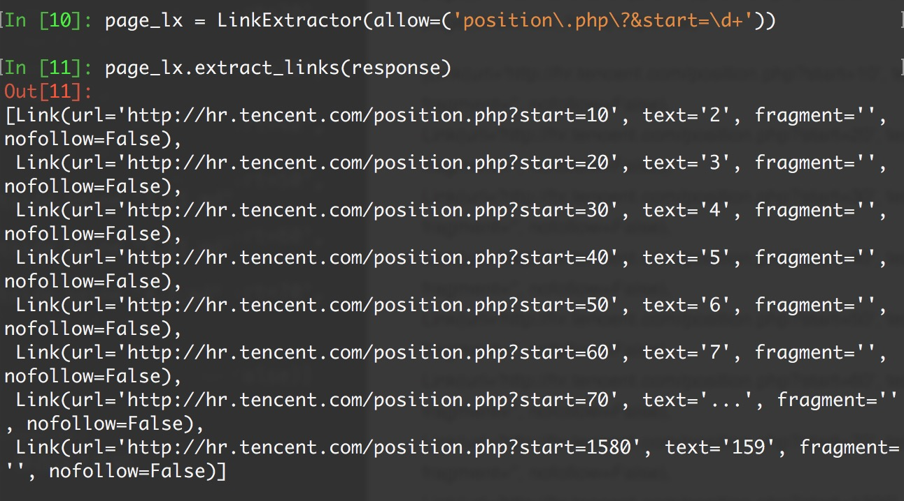

# CrawlSpiders

通过下面的命令可以快速创建 CrawlSpider模板 的代码：

> ```
> scrapy genspider -t crawl tencent tencent.com
> ```

上一个案例中，我们通过正则表达式，制作了新的url作为Request请求参数，现在我们可以换个花样...

```
class scrapy.spiders.CrawlSpider
```

它是Spider的派生类，Spider类的设计原则是只爬取start_url列表中的网页，而CrawlSpider类定义了一些规则(rule)来提供跟进link的方便的机制，从爬取的网页中获取link并继续爬取的工作更适合。

#### 源码参考

```python
class CrawlSpider(Spider):
    rules = ()
    def __init__(self, *a, **kw):
        super(CrawlSpider, self).__init__(*a, **kw)
        self._compile_rules()

    #首先调用parse()来处理start_urls中返回的response对象
    #parse()则将这些response对象传递给了_parse_response()函数处理，并设置回调函数为parse_start_url()
    #设置了跟进标志位True
    #parse将返回item和跟进了的Request对象    
    def parse(self, response):
        return self._parse_response(response, self.parse_start_url, cb_kwargs={}, follow=True)

    #处理start_url中返回的response，需要重写
    def parse_start_url(self, response):
        return []

    def process_results(self, response, results):
        return results

    #从response中抽取符合任一用户定义'规则'的链接，并构造成Resquest对象返回
    def _requests_to_follow(self, response):
        if not isinstance(response, HtmlResponse):
            return
        seen = set()
        #抽取之内的所有链接，只要通过任意一个'规则'，即表示合法
        for n, rule in enumerate(self._rules):
            links = [l for l in rule.link_extractor.extract_links(response) if l not in seen]
            #使用用户指定的process_links处理每个连接
            if links and rule.process_links:
                links = rule.process_links(links)
            #将链接加入seen集合，为每个链接生成Request对象，并设置回调函数为_repsonse_downloaded()
            for link in links:
                seen.add(link)
                #构造Request对象，并将Rule规则中定义的回调函数作为这个Request对象的回调函数
                r = Request(url=link.url, callback=self._response_downloaded)
                r.meta.update(rule=n, link_text=link.text)
                #对每个Request调用process_request()函数。该函数默认为indentify，即不做任何处理，直接返回该Request.
                yield rule.process_request(r)

    #处理通过rule提取出的连接，并返回item以及request
    def _response_downloaded(self, response):
        rule = self._rules[response.meta['rule']]
        return self._parse_response(response, rule.callback, rule.cb_kwargs, rule.follow)

    #解析response对象，会用callback解析处理他，并返回request或Item对象
    def _parse_response(self, response, callback, cb_kwargs, follow=True):
        #首先判断是否设置了回调函数。（该回调函数可能是rule中的解析函数，也可能是 parse_start_url函数）
        #如果设置了回调函数（parse_start_url()），那么首先用parse_start_url()处理response对象，
        #然后再交给process_results处理。返回cb_res的一个列表
        if callback:
            #如果是parse调用的，则会解析成Request对象
            #如果是rule callback，则会解析成Item
            cb_res = callback(response, **cb_kwargs) or ()
            cb_res = self.process_results(response, cb_res)
            for requests_or_item in iterate_spider_output(cb_res):
                yield requests_or_item

        #如果需要跟进，那么使用定义的Rule规则提取并返回这些Request对象
        if follow and self._follow_links:
            #返回每个Request对象
            for request_or_item in self._requests_to_follow(response):
                yield request_or_item

    def _compile_rules(self):
        def get_method(method):
            if callable(method):
                return method
            elif isinstance(method, basestring):
                return getattr(self, method, None)

        self._rules = [copy.copy(r) for r in self.rules]
        for rule in self._rules:
            rule.callback = get_method(rule.callback)
            rule.process_links = get_method(rule.process_links)
            rule.process_request = get_method(rule.process_request)

    def set_crawler(self, crawler):
        super(CrawlSpider, self).set_crawler(crawler)
        self._follow_links = crawler.settings.getbool('CRAWLSPIDER_FOLLOW_LINKS', True)
```

CrawlSpider继承于Spider类，除了继承过来的属性外（name、allow_domains），还提供了新的属性和方法:

## rules

CrawlSpider使用rules来决定爬虫的爬取规则，并将匹配后的url请求提交给引擎。所以在正常情况下，CrawlSpider不需要单独手动返回请求了。

在rules中包含一个或多个Rule对象，每个Rule对爬取网站的动作定义了某种特定操作，比如提取当前相应内容里的特定链接，是否对提取的链接跟进爬取，对提交的请求设置回调函数等。

如果多个rule匹配了相同的链接，则根据规则在本集合中被定义的顺序，第一个会被使用。

```python
class scrapy.spiders.Rule(
        link_extractor,
        callback = None,
        cb_kwargs = None,
        follow = None,
        process_links = None,
        process_request = None
)
```

- `link_extractor`：是一个Link Extractor对象，用于定义需要提取的链接。

- `callback`： 从link_extractor中每获取到链接时，参数所指定的值作为回调函数，该回调函数接受一个response作为其第一个参数。

  > 注意：当编写爬虫规则时，避免使用parse作为回调函数。由于CrawlSpider使用parse方法来实现其逻辑，如果覆盖了 parse方法，crawl spider将会运行失败。

- `follow`：是一个布尔(boolean)值，指定了根据该规则从response提取的链接是否需要跟进。 如果callback为None，follow 默认设置为True ，否则默认为False。

- `process_links`：指定该spider中哪个的函数将会被调用，从link_extractor中获取到链接列表时将会调用该函数。该方法主要用来过滤。

- `process_request`：指定该spider中哪个的函数将会被调用， 该规则提取到每个request时都会调用该函数。 (用来过滤request)

## LinkExtractors

```python
class scrapy.linkextractors.LinkExtractor
```

Link Extractors 的目的很简单: 提取链接｡

每个LinkExtractor有唯一的公共方法是 extract_links()，它接收一个 Response 对象，并返回一个 scrapy.link.Link 对象。

Link Extractors要实例化一次，并且 extract_links 方法会根据不同的 response 调用多次提取链接｡

```python
class scrapy.linkextractors.LinkExtractor(
    allow = (),
    deny = (),
    allow_domains = (),
    deny_domains = (),
    deny_extensions = None,
    restrict_xpaths = (),
    tags = ('a','area'),
    attrs = ('href'),
    canonicalize = True,
    unique = True,
    process_value = None
)
```

主要参数：

- `allow`：满足括号中“正则表达式”的URL会被提取，如果为空，则全部匹配。
- `deny`：满足括号中“正则表达式”的URL一定不提取（优先级高于allow）。
- `allow_domains`：会被提取的链接的domains。
- `deny_domains`：一定不会被提取链接的domains。
- `restrict_xpaths`：使用xpath表达式，和allow共同作用过滤链接。

## 爬取规则(Crawling rules)

继续用腾讯招聘为例，给出配合rule使用CrawlSpider的例子:

1. 首先运行

   ```sh
    scrapy shell "http://hr.tencent.com/position.php?&start=0#a"
   ```

2. 导入LinkExtractor，创建LinkExtractor实例对象。：

   ```python
    from scrapy.linkextractors import LinkExtractor
   
    page_lx = LinkExtractor(allow=('position.php?&start=\d+'))
   ```

   > allow : LinkExtractor对象最重要的参数之一，这是一个正则表达式，必须要匹配这个正则表达式(或正则表达式列表)的URL才会被提取，如果没有给出(或为空), 它会匹配所有的链接｡
   >
   > deny : 用法同allow，只不过与这个正则表达式匹配的URL不会被提取)｡它的优先级高于 allow 的参数，如果没有给出(或None), 将不排除任何链接｡

3. 调用LinkExtractor实例的extract_links()方法查询匹配结果：

   ```python
    page_lx.extract_links(response)
   ```

4. 没有查到：

   ```python
    []
   ```

5. 注意转义字符的问题，继续重新匹配：

   ```python
    page_lx = LinkExtractor(allow=('position\.php\?&start=\d+'))
    # page_lx = LinkExtractor(allow = ('start=\d+'))
   
    page_lx.extract_links(response)
   ```



## CrawlSpider 版本

那么，scrapy shell测试完成之后，修改以下代码

```python
#提取匹配 'http://hr.tencent.com/position.php?&start=\d+'的链接
page_lx = LinkExtractor(allow = ('start=\d+'))

rules = [
    #提取匹配,并使用spider的parse方法进行分析;并跟进链接(没有callback意味着follow默认为True)
    Rule(page_lx, callback = 'parse', follow = True)
]
```

**这么写对吗？**

**不对！千万记住 callback 千万不能写 parse，再次强调：由于CrawlSpider使用parse方法来实现其逻辑，如果覆盖了 parse方法，crawl spider将会运行失败。**

```python
import scrapy
from scrapy.linkextractors import LinkExtractor
from scrapy.spiders import CrawlSpider, Rule


class TecentSpider(CrawlSpider):
    name = 'tecent'
    allowed_domains = ['hr.tencent.com']
    start_urls = ['http://hr.tencent.com/position.php?&start=0']
    page_lx = LinkExtractor(allow=r'start=\d+')
    #position.php?&start=10#a
    rules = (
        Rule(page_lx, callback='parse_item', follow=True),
    )

    def parse_item(self, response):
        items = response.xpath('//*[contains(@class,"odd") or contains(@class,"even")]')
        for item in items:
            temp = dict(
                position=item.xpath("./td[1]/a/text()").extract()[0],
                detailLink="http://hr.tencent.com/" + item.xpath("./td[1]/a/@href").extract()[0],
                type=item.xpath('./td[2]/text()').extract()[0] if len(
                    item.xpath('./td[2]/text()').extract()) > 0 else None,
                need_num=item.xpath('./td[3]/text()').extract()[0],
                location=item.xpath('./td[4]/text()').extract()[0],
                publish_time=item.xpath('./td[5]/text()').extract()[0]
            )
            print(temp)
            yield temp

    # parse() 方法不需要重写     
    # def parse(self, response):                                              
    #     pass
```

运行： `scrapy crawl tencent`

## Logging

Scrapy提供了log功能，可以通过 logging 模块使用。

> 可以修改配置文件settings.py，任意位置添加下面两行，效果会清爽很多。

```
LOG_FILE = "TencentSpider.log"
LOG_LEVEL = "INFO"
```

#### Log levels

- Scrapy提供5层logging级别:
- CRITICAL - 严重错误(critical)
- ERROR - 一般错误(regular errors)
- WARNING - 警告信息(warning messages)
- INFO - 一般信息(informational messages)
- DEBUG - 调试信息(debugging messages)

#### logging设置

通过在setting.py中进行以下设置可以被用来配置logging:

1. `LOG_ENABLED` 默认: True，启用logging
2. `LOG_ENCODING` 默认: 'utf-8'，logging使用的编码
3. `LOG_FILE` 默认: None，在当前目录里创建logging输出文件的文件名
4. `LOG_LEVEL` 默认: 'DEBUG'，log的最低级别
5. `LOG_STDOUT` 默认: False 如果为 True，进程所有的标准输出(及错误)将会被重定向到log中。例如，执行 print "hello" ，其将会在Scrapy log中显示。